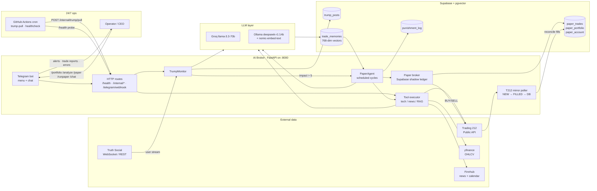
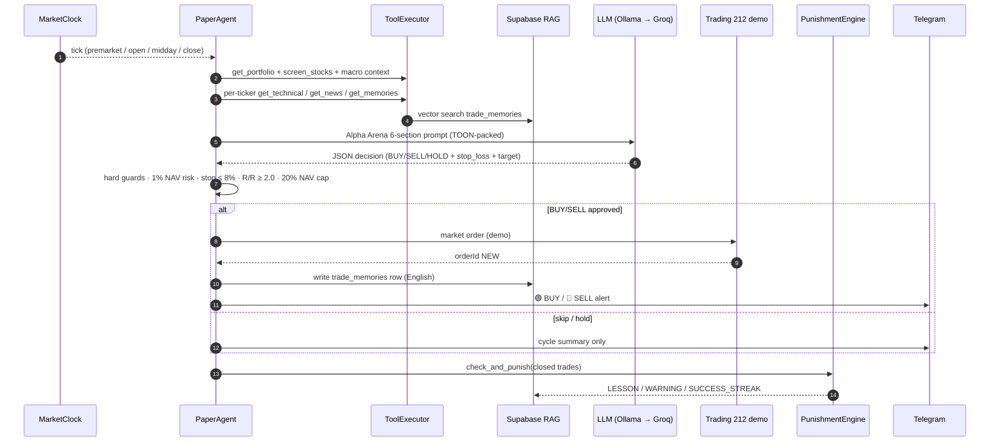

<div align="center">

# AI Broker

Personal AI trading **advisor** — not a chatbot. Reads your Trading 212 portfolio,
fuses it with technicals, news, Trump posts and a Supabase-backed RAG memory,
runs a math-disciplined paper-trading agent, and pushes everything through a
Telegram bot.

[](https://github.com/CemRoot/ai-broker/actions/workflows/ci.yml)
[](pyproject.toml)
[](app/main.py)
[](app/services/llm)
[](sql/schemas)
[](Dockerfile)

</div>

> **Project status (May 2026):** Phase 5 (`/ui`) live; Phase 4 hardened (Docker, Cloudflare Tunnel, GH Actions cron); Paper Agent now mirrors orders to Trading 212 demo with a Supabase shadow ledger. **Git remote:** [`github.com/CemRoot/ai-broker`](https://github.com/CemRoot/ai-broker) (private). **Canonical Turkish roadmap** (`AI_BROKER_PROJECT.md`) and **internal todo** (`ai-broker-todo.md`) are **`.gitignore`’d** on public clones — keep your own local copies; dated shipped history: [`CHANGELOG.md`](CHANGELOG.md).

---

## Table of contents

1. [What it does](#1-what-it-does)
2. [System architecture](#2-system-architecture)
3. [Paper Agent decision loop](#3-paper-agent-decision-loop)
4. [Quick start](#4-quick-start)
5. [Configuration (`.env`)](#5-configuration-env)
6. [Running](#6-running)
7. [Telegram bot](#7-telegram-bot)
8. [HTTP API](#8-http-api)
9. [24/7 deployment](#9-247-deployment)
10. [Testing](#10-testing)
11. [Repository layout](#11-repository-layout)
12. [License & disclaimer](#12-license--disclaimer)

---

## 1. What it does

| Capability | Source of truth |
|---|---|
| Read open positions, P&L, account summary from **Trading 212** demo or live | [`app/services/t212`](app/services/t212) |
| Pull OHLCV + 31 engineered features from **yfinance** | [`app/tools/technical.py`](app/tools/technical.py) |
| Score company news from **Finnhub** in batches (~50 articles / call) | [`app/services/news_pipeline.py`](app/services/news_pipeline.py) |
| Watch **Truth Social** for new Trump posts (WebSocket + REST cron fallback) | [`app/services/trump_monitor.py`](app/services/trump_monitor.py) |
| Persist trades, lessons, and embeddings in **Supabase + pgvector** | [`app/memory`](app/memory) · [`sql/schemas`](sql/schemas) |
| Run an autonomous **Paper Agent** with €20k virtual NAV, RAG memory, and a tiered punishment / reward engine | [`app/agents`](app/agents) |
| Mirror Paper Agent BUY/SELL into Trading 212 demo and reconcile back | [`app/services/paper`](app/services/paper) |
| Talk to the operator via a menu-driven, free-text-aware **Telegram** bot | [`app/bot`](app/bot) |
| Surface a small browser UI for ad-hoc analysis | `WEB_UI_ENABLED=true` → `GET /ui` |

LLM strategy: **Groq `llama-3.3-70b-versatile`** primary, **Ollama `deepseek-r1:14b`** local fallback, **`nomic-embed-text`** for 768-dim embeddings. Set `PREFER_LOCAL_LLM=true` to route Paper Agent / news scoring through Ollama first and keep Groq tokens for emergencies.

---

## 2. System architecture



Black arrows = data flow; everything that touches state is persisted in Supabase so the next cycle (or the next deploy) can reason from history rather than chat memory. Detailed module map (local file, not in public repo): `AI_BROKER_PROJECT.md` § Mimari.

---

## 3. Paper Agent decision loop



Hard rules enforced in code (`PaperAgent._apply_decision`):

- Risk ≤ **1% NAV** per trade (`R = 0.01 × NAV`, `shares ≈ R / |entry − stop|`)
- Stop distance ≤ **8%** (ATR-aware preferred)
- Reward / Risk ≥ **2.0** — anything below is auto-skipped
- Position size ≤ **20% NAV** in T212 mode
- `confidence < 0.60` → forced HOLD/SKIP
- Drawdown ≥ **30% NAV** → BUY halt until recovery

The 8-tier punishment / reward engine (`app/agents/punishment.py`) maps closed-trade P&L to concrete consequences:

| P&L bucket | Action |
|---|---|
| ≥ +10% | `BIG_WIN` + `SUCCESS_STREAK` if 3+ in a row |
| +5 ≤ P&L < +10% | `WIN` + streak check |
| −3% < P&L < 0% | INFO log only (noise band) |
| −5% ≤ P&L ≤ −3% | `CONFIDENCE_CUT` 1 day |
| −8% < P&L < −5% | `CONFIDENCE_CUT` 2 days + LESSON |
| −10% < P&L ≤ −8% | `COOLDOWN` 3 days + LESSON |
| P&L ≤ −10% | `COOLDOWN` 7 days + LESSON ("blow-up circuit breaker") |
| 3+ consecutive losses | `COOLDOWN` 3 days + LESSON |

---

## 4. Quick start

```bash
# 1. Tooling — uv (https://docs.astral.sh/uv) is required
curl -LsSf https://astral.sh/uv/install.sh | sh
uv python install 3.12

# 2. Clone and create venv
git clone https://github.com/<your-account>/ai-broker.git
cd ai-broker
uv sync --all-extras

# 3. Secrets — copy template, fill in values, never commit
cp .env.example .env

# 4. Apply Supabase schema (idempotent)
PYTHONPATH=. uv run python scripts/apply_sql_schemas.py

# 5. Run the broker locally (Telegram in polling mode)
PYTHONPATH=. uv run uvicorn app.main:app --reload
```

Open `http://127.0.0.1:8000/health` — you should see `status: ok`, `telegram.handlers_ready: true`, and `memory_db.asyncpg_pool_ready: true`.

---

## 5. Configuration (`.env`)

Minimal viable Phase 2 setup needs at least these keys:

| Variable | Purpose |
|---|---|
| `GROQ_API_KEY` | Primary LLM ([console.groq.com](https://console.groq.com)) |
| `T212_DEMO_API_KEY` / `T212_DEMO_API_SECRET` | Trading 212 → Settings → API. Required scopes: `account`, `portfolio`, `orders:read`, `orders:execute`, `history:orders`. |
| `T212_BASE_URL` | `https://demo.trading212.com` (recommended) or `https://live.trading212.com` |
| `TELEGRAM_BOT_TOKEN` | From [@BotFather](https://t.me/BotFather) |
| `TELEGRAM_ALLOWED_USER_IDS` | Comma-separated Telegram user IDs (**required**; without it commands are rejected) |
| `SUPABASE_DB_URL` | `postgresql://...` connection string (asyncpg + pgvector) |
| `OLLAMA_BASE_URL` / `OLLAMA_MODEL` | Local fallback LLM (`http://localhost:11434`, `deepseek-r1:14b`) |
| `FINNHUB_API_KEY` | News & sentiment ([finnhub.io](https://finnhub.io)) |
| `INTERNAL_API_KEY` | If set, all `/internal/*` requests must send `X-Internal-Api-Key` |
| `TELEGRAM_WEBHOOK_URL` / `TELEGRAM_WEBHOOK_SECRET` | Webhook mode (production); leave URL empty for polling |
| `PREFER_LOCAL_LLM` | `true` → Paper Agent + news scoring use Ollama first, Groq only on failure |
| `PAPER_EXECUTES_ON_T212` | `true` to mirror Paper Agent orders into T212 demo |
| `USE_TOON_PROMPTS` | `true` → numeric tables sent to LLMs are TOON-packed (~10–15% token saving) |

Full reference with dummy values: [`.env.example`](.env.example). **Never commit a real `.env`** — the `.gitignore` blocks it but treat the file as a secret regardless.

---

## 6. Running

### Local development

```bash
# Telegram in polling mode (no public URL needed)
PYTHONPATH=. uv run uvicorn app.main:app --reload
```

### Production-style with Docker

```bash
# Builds a multi-stage slim-bookworm image (~350 MB) and starts Ollama side-car
docker compose up --build -d
docker compose logs -f ai-broker
curl -s http://127.0.0.1:8000/health | jq .
```

Image hardening built in:

- **Two-stage build** with BuildKit cache mounts (`uv` + `apt`)
- **Non-root user** (`appuser`, uid 10001)
- **Read-only root filesystem** + `tmpfs:/tmp` (compose)
- All Linux capabilities dropped, `no-new-privileges`
- `tini` PID 1 for proper signal handling
- HEALTHCHECK against `/health` with 90-second warm-up
- Log rotation (`json-file`, 20 MB × 5)

Detailed deploy / Cloudflare Tunnel / server sizing (Hetzner CX22 vs GEX44): [`docs/FAZ4_DEPLOY.md`](docs/FAZ4_DEPLOY.md).

---

## 7. Telegram bot

Type any free-text message → routed to Ollama as a quick answer.

| Command | Effect |
|---|---|
| `/start` | Welcome + menu hint |
| `/portfolio` | T212 account summary + open positions |
| `/analyze AAPL [news] [full]` | Technical + LLM (optionally + news batch + extended OHLC features) |
| `/news AAPL` | Finnhub batch news scoring |
| `/memory AAPL` | RAG memory recall (LESSON / WARNING / SUCCESS) for ticker |
| `/paper` | Supabase paper portfolio (mirrors T212 demo when enabled) |
| `/runpaper` | Trigger one Paper Agent cycle on demand |
| `/usage` | Today's Groq token / request counters |

The bot is also a menu — Telegram clients show the commands above in a tap-to-run dropdown. The implementation lives in [`app/bot/handlers.py`](app/bot/handlers.py).

---

## 8. HTTP API

| Path | Method | Description |
|---|---|---|
| `/health` | GET | Liveness + integration flags |
| `/public/live` | GET | Public paper snapshot (when `PUBLIC_DASHBOARD_ENABLED=true`). With `PAPER_EXECUTION_BACKEND=t212`, NAV and open positions are read from the **Trading 212 Public API** on each request; trade rows remain the Supabase audit mirror. |
| `/finance` | GET | Static dashboard HTML (same flag; polls `/public/live` + `/health`) |
| `/ui` | GET | Browser analysis page (only when `WEB_UI_ENABLED=true`) |
| `/internal/positions` | GET | T212 open positions |
| `/internal/technical/extended?symbol=AMD` | GET | 31-feature OHLCV row |
| `/internal/news/batch` | POST | Score arbitrary article list |
| `/internal/news/analyze?symbol=AMD` | GET | Finnhub fetch + LLM scoring |
| `/internal/analyze?symbol=AMD` | POST | Combined technical (+ news / extended) + final LLM |
| `/internal/usage` | GET | Groq daily token / request counters |
| `/internal/trump/pull?limit=10` | POST | REST polling fallback (used by GH Actions) |
| `/telegram/webhook` | POST | Telegram webhook target |
| `/docs` | GET | Auto-generated Swagger UI |

When `INTERNAL_API_KEY` is set, every `/internal/*` request must carry `X-Internal-Api-Key`.

**Public dashboard:** not financial advice; figures are informational and can lag or diverge from the broker app (pending orders, sync, API errors). Optional CORS: `PUBLIC_DASHBOARD_CORS_ORIGINS` (comma-separated).

---

## 9. 24/7 deployment

The bot is a **stateful long-running process** (FastAPI + asyncio + WebSocket clients to Trading 212 / Truth Social + asyncpg pool). It cannot live on serverless platforms whose handlers are recycled per request. Recommended split:

| Concern | Where it should live | Why |
|---|---|---|
| FastAPI core, Telegram polling/webhook, Paper Agent loop, T212 mirror poller, TrumpMonitor WebSocket | A single small VPS (e.g. **Hetzner CX22 ~€5/mo**) running `docker compose` | Persistent process; full asyncpg pool; survives restarts |
| Public Telegram webhook URL | **Cloudflare Tunnel** in front of the VPS | Free TLS, no port forwarding, spam-protected |
| Trump posts when the WebSocket is silent (e.g. bot account does not follow Trump) | **GitHub Actions cron** every 5 min → `POST /internal/trump/pull` | Guarantees coverage independent of WebSocket |
| Hourly liveness probe + email-on-failure | **GitHub Actions cron** every hour → `GET /health` | Free 24/7 monitoring, no Pingdom needed |
| CI on push / PR | **GitHub Actions** (`ci.yml`) — ruff + pytest (`-m "not ollama"`) | Runners have no Ollama; full embedding checks stay local |
| Heavy local LLM (Ollama 14B at 7×24) | Optional **Hetzner GEX44** (€189/mo) per [`docs/FAZ4_DEPLOY.md`](docs/FAZ4_DEPLOY.md) | Only if you want to eliminate Groq tokens entirely |

The three workflow files live in [`.github/workflows/`](.github/workflows). They need only two repository secrets — `AIBROKER_BASE_URL` and `AIBROKER_INTERNAL_KEY` — both set in **Settings → Secrets and variables → Actions**.

---

## 10. Testing

```bash
# Full test suite (unit + offline integration)
uv run pytest tests/ -q

# Same subset GitHub Actions runs (unit tests that do not call Ollama)
uv run pytest tests/unit -q -m "not ollama"

# Lint
uv run ruff check app tests scripts

# Live single Paper Agent cycle (T212 + Ollama + Supabase, dry-run = no orders)
PYTHONPATH=. uv run python scripts/live_paper_cycle.py --no-trades

# Same script but actually places T212 demo orders
PYTHONPATH=. uv run python scripts/live_paper_cycle.py
```

Phase-3 end-to-end checklist runner: `PYTHONPATH=. uv run python scripts/faz3_e2e_check.py`. Inspect Supabase paper tables: `PYTHONPATH=. uv run python scripts/inspect_paper_supabase.py`.

---

## 11. Repository layout

```
app/
├── api/                # FastAPI routes
├── agents/             # PaperAgent, PunishmentEngine, PositionMonitor
├── bot/                # Telegram handlers, menu install, chat routing
├── core/               # Settings, logging
├── memory/             # asyncpg pool, embedder, retriever (RAG)
├── modules/            # Domain modules (ten + paper)
├── services/           # T212, Finnhub, Truth Social, news pipeline, paper broker
└── tools/              # technical, technical_extended, executor (LLM tool dispatch)
docs/                   # FAZ4_DEPLOY.md, decision logs
experiments/model_race/ # Phase 0 benchmarks only (Groq/Ollama/Cerebras); not production wiring
results/                # local outputs from `faz0_test.py` (gitignored — recreate by running experiments)
scripts/                # apply_sql_schemas, faz3_e2e_check, live_paper_cycle, inspect_paper_supabase, …
sql/schemas/            # 001_memory, 002_paper_trading, 003_paper_agent, 004_t212_paper_execution
tests/                  # unit, integration
.github/workflows/      # ci, healthcheck, trump-pull-cron
Dockerfile              # multi-stage, non-root, healthchecked
docker-compose.yml      # ai-broker + ollama, hardened
AI_BROKER_PROJECT.md    # canonical Turkish roadmap (gitignored on public push — local copy only)
ai-broker-todo.md       # internal checklist (gitignored — local copy only)
CHANGELOG.md            # dated, append-only history (tracked)
```

---

## 12. License & disclaimer

Source-available, **not** a public package — for personal use by the project owner. The bot **only recommends and paper-trades on Trading 212 demo by default**. Live trading is opt-in (`T212_BASE_URL=https://live.trading212.com`) and remains the operator's responsibility. Nothing here is investment advice.
